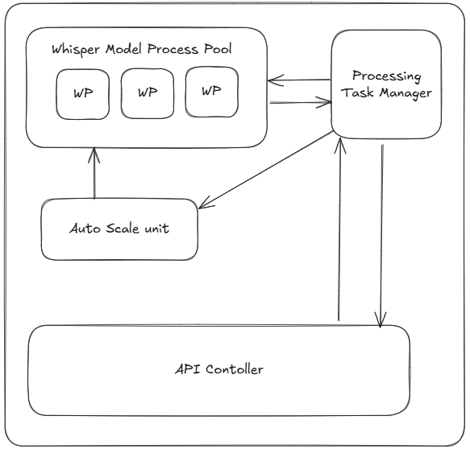

# Whisper Speech-to-Text System

A high-performance speech-to-text transcription system built with OpenAI's Whisper model using the CTranslate2 backend for optimized inference.

## Features

- **GPU Acceleration**: CUDA support for fast transcription
- **Batch Processing**: Efficient processing of multiple audio files
- **Auto-scaling**: Dynamic resource allocation based on workload
- **Beam Search**: Enhanced transcription accuracy
- **Access Token Authentication**: Secure API access
- **Connection Pooling**: Optimized resource management

## Architecture



The system uses whisper_s2t with CTranslate2 backend for optimized performance and resource utilization.

## Requirements

- Python 3.8+
- CUDA-compatible GPU (recommended)
- CUDA toolkit and drivers installed

## Installation

### 1. Clone the Repository
```bash
git clone <repository-url>
cd whisper-speech-to-text
```

### 2. Create Virtual Environment
```bash
# Create environment
python -m venv whisper_env

# Activate environment
# On Windows:
whisper_env\Scripts\activate
# On Linux/Mac:
source whisper_env/bin/activate
```

### 3. Install Dependencies
```bash
pip install -r requirements.txt
```

## Configuration

The system is configured via a JSON configuration file:

```json
{
    "gpu_list": ["cuda:0"],
    "model_name": "tiny",
    "batch_size": 48,
    "file_batch_size": 5,
    "beam_size": 5,
    "enable_auto_scale": true,
    "max_auto_scale_limit": 2,
    "enable_access_token": true,
    "pool_config": {
        "size": 1
    }
}
```

### Configuration Parameters

| Parameter | Description | Default |
|-----------|-------------|---------|
| `gpu_list` | List of GPU devices to use | `["cuda:0"]` |
| `model_name` | Whisper model size (`tiny`, `base`, `small`, `medium`, `large`) | `"tiny"` |
| `batch_size` | Number of audio samples per batch | `48` |
| `file_batch_size` | Number of files processed simultaneously | `5` |
| `beam_size` | Beam search width for better accuracy | `5` |
| `enable_auto_scale` | Enable dynamic scaling | `true` |
| `max_auto_scale_limit` | Maximum scaling factor | `2` |
| `enable_access_token` | Enable authentication | `true` |
| `pool_config.size` | Connection pool size | `1` |

## Usage

### Starting the API Server
```bash
python src/main.py
```

The API server will start on `http://127.0.0.1:8000` by default.

### API Endpoints

#### Transcribe Audio
```bash
curl -X 'POST' \
  'http://127.0.0.1:8000/transcribe?language=en' \
  -H 'accept: application/json' \
  -H 'Content-Type: multipart/form-data' \
  -F 'file=@test1.wav;type=audio/wav'
```

**Parameters:**
- `language`: Language code (e.g., `en` for English, `es` for Spanish, `fr` for French)
- `file`: WAV audio file (16 kHz sample rate)

**Response:**
```json
{
  "text": "Transcribed text content",
  "language": "en",
  "duration": 12.5
}
```

### Model Selection Guide

| Model | Speed | Accuracy | GPU Memory | Use Case |
|-------|-------|----------|------------|----------|
| `tiny` | Fastest | Basic | ~1GB | Real-time, draft transcription |
| `base` | Fast | Good | ~1GB | Balanced performance |
| `small` | Medium | Better | ~2GB | Production quality |
| `medium` | Slower | High | ~5GB | High accuracy needed |
| `large` | Slowest | Highest | ~10GB | Maximum accuracy |

## Performance Tuning

### GPU Memory Optimization
- **Low Memory (4GB)**: Use `tiny` or `base` model, reduce `batch_size` to 16-32
- **Medium Memory (8GB)**: Use `small` model, `batch_size` 32-64
- **High Memory (16GB+)**: Use `medium`/`large` model, `batch_size` 64+

### Batch Size Recommendations
```python
# Monitor GPU memory usage and adjust accordingly
nvidia-smi  # Check GPU memory usage
```

### Connection Pool Sizing
- **Single user**: `pool_config.size = 1`
- **Multiple concurrent users**: `pool_config.size = 2-4`
- **High load**: Scale based on concurrent request patterns

## Supported Audio Formats

- **WAV files only** (16 kHz sample rate required)

## API Authentication

When `enable_access_token` is true, include authentication headers in your requests:
```bash
curl -X 'POST' \
  'http://127.0.0.1:8000/transcribe?language=en' \
  -H 'accept: application/json' \
  -H 'Authorization: Bearer YOUR_ACCESS_TOKEN' \
  -H 'Content-Type: multipart/form-data' \
  -F 'file=@test1.wav;type=audio/wav'
```

## Troubleshooting

### Common Issues

**CUDA Not Available**
```bash
# Check CUDA installation
python -c "import torch; print(torch.cuda.is_available())"
```

**Out of Memory Error**
- Reduce `batch_size` in configuration
- Use smaller model (`tiny` or `base`)
- Process fewer files simultaneously

**Slow Performance**
- Ensure GPU acceleration is working
- Increase `batch_size` if memory allows
- Consider using larger model for better beam search efficiency

**Installation Issues**
```bash
# Update pip and reinstall
pip install --upgrade pip
pip install -r requirements.txt --force-reinstall
```

**Unsupported Audio Format**
- Only WAV files with 16kHz sample rate are supported
- Convert your audio files using ffmpeg before uploading

### Performance Monitoring

Monitor system performance:
```bash
# GPU usage
nvidia-smi -l 1

# System resources
htop

# Python memory usage
pip install memory-profiler
python -m memory_profiler src/main.py
```

## Changelog

### Version History
- **v1.0.0**: Initial release with CTranslate2 backend
- [Add version history as needed]